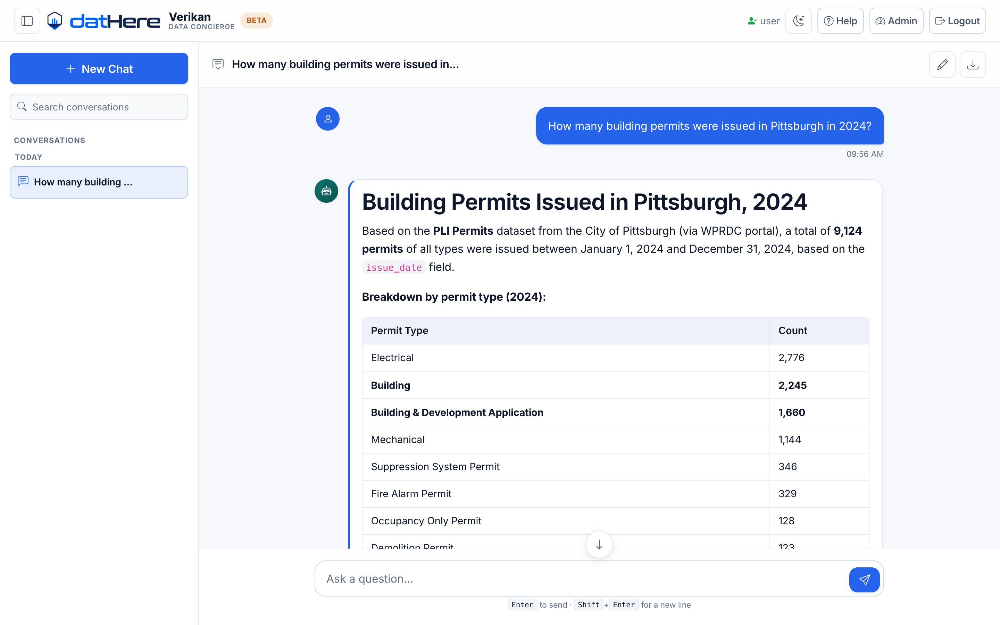
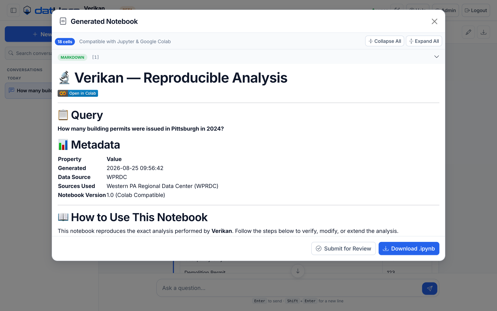
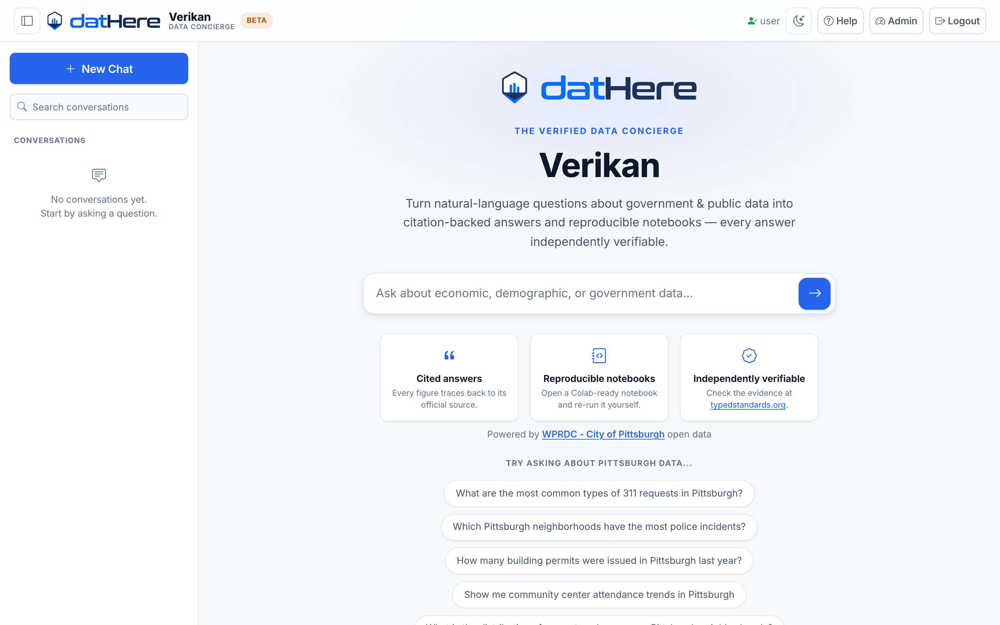
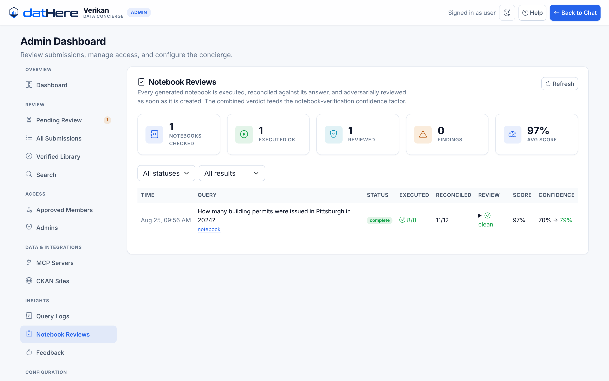

<div align="center">

# Verikan

### The verified Data Concierge

**Ask a question about public data in plain English. Get a citation-backed answer — and the reproducible notebook that derives it.**

[](https://www.python.org/)
[](LICENSE)
[](https://fastapi.tiangolo.com/)
[](https://langchain-ai.github.io/langgraph/)
[](https://www.anthropic.com/)

</div>

<p align="center">
  
</p>

---

## Why this exists

Most AI data tools hand you a number and ask you to trust it. Verikan hands you the number,
the notebook that computed it, and an honest account of how much it checked its own work.

Every answer generates a self-contained Colab-ready notebook. That notebook is then
**executed**, its output **reconciled** against the answer's numeric claims, and its method
**adversarially reviewed** — before you're shown a confidence score.

```
"How many building permits were issued in Pittsburgh in 2024?"
    │
    ├─  finds the dataset on the open data portal, loads it, runs the query
    ├─  writes the answer with citations
    ├─  generates a runnable .ipynb
    └─  executes + reviews that notebook, then scores its own confidence
```

<table>
<tr>
<td width="33%" valign="top">

### 📓 The notebook is the evidence

Not a description of the analysis — the analysis itself. Open it in Colab and re-run it.

</td>
<td width="33%" valign="top">

### 🔍 It checks its own work

The notebook is executed and its numbers must match the answer's. Claims that can't be
re-derived don't get credit.

</td>
<td width="33%" valign="top">

### 🙅 It admits what it doesn't know

A check that couldn't run is reported as *unavailable, with a reason* — never quietly
scored as zero.

</td>
</tr>
</table>

---

## How the verification works

Three independent signals merge into one confidence factor:

| Signal | What it asks | Why it matters |
|---|---|---|
| **Execution** | Does the notebook actually run? | A notebook that errors is a measured failure, not a footnote |
| **Reconciliation** | Do the answer's numbers appear in the notebook's *own* output? | Re-deriving a figure from published code beats finding it in the transcript the model already had |
| **Adversarial review** | Is the *method* sound? | Catches what execution can't: a hardcoded number runs perfectly and reconciles perfectly |

Every factor is shown in the UI, including any that could not be measured — and why.

---

## Every answer ships with its notebook

<p align="center">
  
</p>

The notebook is built from the pipeline's own execution trace, so it reproduces the analysis
rather than narrating it. Download the `.ipynb`, or open it straight in Google Colab.

**Follow-ups edit the notebook.** Ask for a change — *"use a different dataset"*, *"that
number looks wrong"* — and Verikan edits the existing notebook cell by cell instead of
starting over, then puts the revision through the same execution and review pass.

---

## Quick start

### Prerequisites

- **Python 3.11+**
- An **Anthropic API key** ([console.anthropic.com](https://console.anthropic.com/))

No other credential is required. The default data source — [WPRDC](https://data.wprdc.org)
Pittsburgh open data — needs no API key at all.

### Install and run

```bash
git clone https://github.com/dathere/Verikan.git
cd Verikan

python3 -m venv .venv
source .venv/bin/activate          # Windows: .venv\Scripts\activate

pip install -e ".[dev]"
cp .env.example .env               # then add your ANTHROPIC_API_KEY

./run_web.sh
```

Open **<http://localhost:8501>**.

<p align="center">
  
</p>

### Sign in

Click **Login** (top right). A fresh install seeds one local account:

| | |
|---|---|
| **Username** | `user` |
| **Password** | `datHere@123`, or whatever you set as `USER_PASSWORD` before first start |

> [!WARNING]
> That seeded password is a local-development convenience. Set `USER_PASSWORD` in `.env`
> before exposing the app to anyone else.

To get **admin** access (review queue, notebook reviews, settings), name your account in
`.env` *before the first run*:

```env
ADMIN_USERS=user
USER_PASSWORD=choose-your-own
```

`ADMIN_USERS` seeds only on first run; after that, roles live in `roles.json` and are managed
from the admin panel.

### Where things live

| URL | |
|---|---|
| `/` | Chat interface |
| `/admin` | Admin panel — submissions, query logs, notebook reviews, settings |
| `/library` | Verified notebook library |
| `/docs` | User guide |
| `/api/docs` | FastAPI Swagger UI |

---

## The admin panel

<p align="center">
  
</p>

Every verification lands here: whether the notebook executed, how many of the answer's claims
were reconciled, what the adversarial review found, and how the combined verdict moved the
confidence score.

---

## Configuration

All settings come from `.env` (see [`.env.example`](.env.example)). **Only
`ANTHROPIC_API_KEY` is needed to get started** — every other integration degrades gracefully.

<details>
<summary><b>Data sources</b></summary>

<br>

| Variable | Enables | Without it |
|---|---|---|
| `ANTHROPIC_API_KEY` | All analysis | UI loads; queries can't run |
| *(none needed)* | **WPRDC / CKAN open data portals** | works out of the box |
| `BLS_API_KEY` | Bureau of Labor Statistics | 25 requests/day instead of 500 |
| `CENSUS_API_KEY` | Census Bureau | Census queries unavailable |
| `BEA_API_KEY` | Bureau of Economic Analysis (GDP) | BEA queries unavailable |
| `FRED_API_KEY` | Federal Reserve Economic Data | FRED queries unavailable |
| `DATA_COMMONS_API_KEY` | Google Data Commons | Data Commons queries unavailable |
| `PINECONE_API_KEY` | Semantic search over dataset metadata | Falls back to keyword search |

</details>

<details>
<summary><b>Optional services</b></summary>

<br>

| Variable | Purpose | Without it |
|---|---|---|
| `REDIS_HOST` | Response caching | Runs uncached; connection errors logged and ignored |
| `AUTH0_*` | Social login | Username/password login only |
| `GITHUB_TOKEN`, `GITHUB_REPO` | Publish verified notebooks to a repo | Publishing disabled |
| `SMTP_*` | Admin email notifications | Notifications disabled |

</details>

<details>
<summary><b>Behaviour flags</b></summary>

<br>

| Variable | Default | Effect |
|---|---|---|
| `NOTEBOOK_VERIFICATION_ENABLED` | `true` | Execute each notebook and reconcile its output |
| `NOTEBOOK_REVIEW_ENABLED` | `true` | Adversarial method review |
| `FOLLOWUP_LLM_ENABLED` | `true` | Understand chat follow-ups / revision requests |
| `LLM_MODEL` | `claude-sonnet-5` | Main analysis model |

Notebook verification executes generated code. It's contained: a subprocess with a hard
timeout, a minimal environment allowlist that withholds every credential, shell-escape cells
skipped, and an egress guard blocking loopback, private, link-local and cloud-metadata
addresses from inside the kernel. Set `NOTEBOOK_VERIFICATION_ENABLED=false` to turn it off.

</details>

---

## Docker

```bash
cp .env.example .env      # add your ANTHROPIC_API_KEY
docker compose up --build
```

Served on **<http://localhost:8080>**.

<details>
<summary><b>Optional: a local CKAN portal</b></summary>

<br>

A full CKAN stack for developing against a local open data portal ships behind a profile:

```bash
docker compose --profile fairstore up
```

This starts CKAN, PostgreSQL and Solr alongside the app. Not needed for normal development —
the public WPRDC portal works without it.

</details>

---

## Architecture

Two LangGraph graphs, selected by data source:

- **LLM-driven graph** (CKAN / WPRDC / MCP sources) — Claude drives retrieval with tool
  calling: search datasets, inspect them, load rows, run SQL, then write the answer.
- **Deterministic graph** (Data Commons) — parse entities → route → retrieve → compute →
  visualise → cite → generate notebook.

Both end at notebook generation, confidence scoring, and the async verification + review
pass. Every agent action appends to an `execution_trace`, and that trace is what the notebook
generator turns into runnable cells.

<details>
<summary><b>Project layout</b></summary>

<br>

```
src/data_concierge/
  ui/web.py                  # Primary entrypoint — FastAPI + Jinja2 web app
  api/main.py                # Secondary REST-only app
  gateway/
    router.py                # All /api/v1 endpoints
    intent_classifier.py     # Regex intent + complexity classification
    notebook_verification.py # Schedules execution + review, merges into confidence
    followup.py              # Chat follow-up classifier (new question vs revision)
    verified_notebooks.py    # Verified notebook library
    evidence.py              # Typed Standards evidence packages
    session.py, chats.py     # Session and chat storage
  agents/
    supervisor.py            # Builds both graphs; routes by data source
    llm_agent.py             # LLM-driven agent for CKAN / MCP sources
    query_parser.py          # Entity extraction for the deterministic graph
    data_finder.py           # Data Commons retrieval
    stats_computer.py        # Statistical computation
    viz_builder.py           # Vega-Lite visualisation specs
    citation_builder.py      # Citation formatting
    notebook_generator.py    # .ipynb generation from the execution trace
    notebook_verifier.py     # Executes a notebook, reconciles output vs answer
    notebook_reviewer.py     # Adversarial method review
    notebook_editor.py       # Edits a notebook per a chat follow-up
  data_layer/connectors/     # Data Commons, BLS, Census, BEA, FRED, CKAN, Pinecone
  mcp/                       # Model Context Protocol client, registry, connector
  core/
    config.py                # All settings
    confidence.py            # Multi-factor confidence scoring
    models.py                # Pydantic models
configs/                     # Data source registry, MCP server definitions
tests/unit, tests/integration
examples/                    # Sample generated notebooks
```

</details>

---

## Development

```bash
pytest                                  # test suite
ruff check src/ tests/ scripts/         # lint — currently clean
ruff format src/ tests/ scripts/        # format
mypy src/                               # type check — see note
```

Tests are plain pytest with `asyncio_mode = "auto"`. The suite uses real classifiers and state
objects rather than mocks, and notebook-verification tests genuinely execute notebooks, so a
full run takes a little longer than a typical unit suite. A session-scoped fixture points
storage at a temp directory, so a test run never writes into your checkout.

> [!NOTE]
> `ruff check` passes. `ruff format` and `mypy src/` both report a backlog inherited from
> pre-open-source development, and neither is a CI gate yet. If you're sending a patch, keep
> `ruff check` clean and match the surrounding style rather than reformatting whole files — a
> repo-wide reformat would bury real changes in noise.

<details>
<summary><b>Notes for contributors</b></summary>

<br>

- `GraphState` (`agents/state.py`) is a `TypedDict`, not a Pydantic model — LangGraph requires
  this. Read keys with `.get()`.
- Any agent action that retrieves, computes, visualises or cites **must** append to
  `state["execution_trace"]`, or the generated notebook is silently incomplete.
- Route order in `gateway/router.py` is load-bearing: specific paths before wildcards like
  `/{query_id}`.
- `/query` never surfaces a raw exception — every failure path returns a friendly answer plus
  suggested follow-up questions.
- A confidence factor that can't be computed is `None` with a reason, never `0.0`.
- The UI is token-based with light and dark themes; JavaScript in `ui/static/js/` binds to
  element ids in the Jinja templates — change both sides together.

</details>

---

## Troubleshooting

<details>
<summary><code>ModuleNotFoundError: No module named 'data_concierge'</code></summary>

<br>

Run `pip install -e ".[dev]"` inside the activated virtual environment, or set
`PYTHONPATH="$(pwd)/src"`.

</details>

<details>
<summary><b>Queries fail but the UI loads</b></summary>

<br>

Expected without `ANTHROPIC_API_KEY`. Set it in `.env` and restart.

</details>

<details>
<summary><b>Redis connection errors on startup</b></summary>

<br>

Redis is optional and `REDIS_HOST` defaults to `localhost`, so the app keeps trying to reach
one. Either start a local instance (`docker run -p 6379:6379 redis`) or ignore the log lines —
caching is skipped and everything else works.

</details>

<details>
<summary><b>Notebook verification never completes</b></summary>

<br>

It runs as a background task after the answer is returned, and takes seconds to minutes
depending on the notebook. Set `NOTEBOOK_VERIFICATION_ENABLED=false` to skip it during
development.

</details>

---

## A note on issue references

Comments and docstrings cite issue numbers like `(#131)` or `issue #104`. Those refer to the
private tracker this project was developed in before it was open sourced — they're kept
because they mark *why* a piece of code exists, but they don't correspond to issues in this
repository.

---

<div align="center">

**MIT licensed** — see [LICENSE](LICENSE)

Built by [datHere](https://dathere.com) · Evidence format by [Typed Standards](https://typedstandards.org)

</div>
